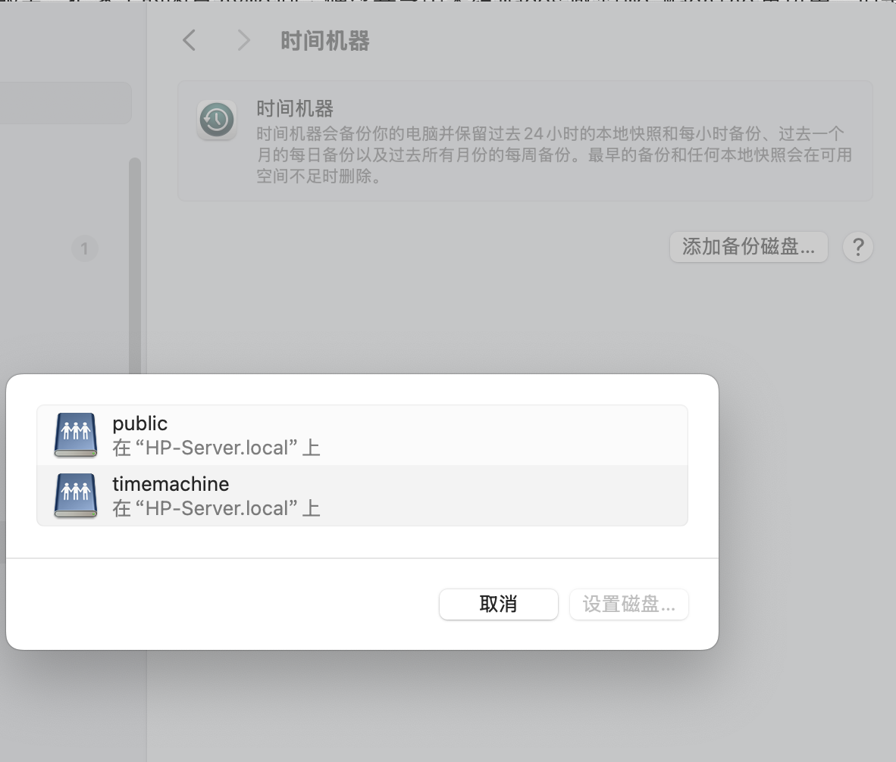
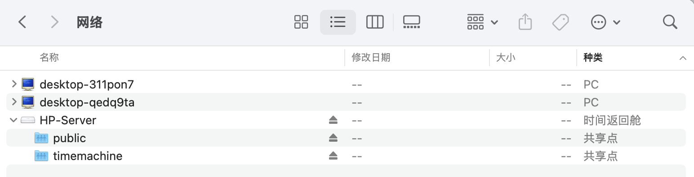

## 背景

之前自己搭建的`samba`服务，把家里的闲置`nvme`固态硬盘共享出来给`macos`做`Time Machine`备份用。但是这块硬盘有点小，现在已经满了，正好最近又找到了一块自己很久以前购买的西部数据USB 1TB移动机械硬盘，本着物尽其用的原则，打算把它挂在我的`Linux`上专门做`Time Machine`备份用。另外，之前使用的`docker`镜像比较古老，而且有一些小问题，这次顺带一起全部解决了。

## 成果展示

先看一下折腾的成果，就是在`macos`的时间机器中直接扫描到两个`share`，`finder`的网络中也能直接看到，非常的方便。





## 镜像选择

之前使用的镜像[dperson/samba](https://hub.docker.com/r/dperson/samba)，4年没有更新了，问了下`ChatGPT`，目前针对我的场景，`macos`兼容性最好的镜像是[ghcr.io/servercontainers/samba](https://github.com/ServerContainers/samba)。这个镜像配置好后可以直接在`macOS`的`Finder`的网络页签直接被扫描到，并且直接可以访问，省去了手动输入服务器地址的烦恼。而且，这个镜像可以在**一个容器里配置多个share**，非常的方便。

## USB移动硬盘格式化与自动挂载

### 1.先确认硬盘设备名。把盘插上后执行：

```shell
lsblk -o NAME,SIZE,FSTYPE,LABEL,UUID,MOUNTPOINT
```

我这里是`/dev/sdc`

### 2.取消挂载分区

```shell
sudo umount /dev/sdc1 >/dev/null
```

**注意，移动硬盘所有的分区都要取消挂载！**

### 3.删除硬盘下所有分区

如果你的USB移动硬盘之前制作过启动盘或相关工具，可能会存在隐藏分区，建议删除分区。使用交互式命令工具fdisk

```shell
sudo fdisk /dev/sdc
```

然后重复输入`d,d,d`**直到所有分区删除完毕**，按`w`保存写入。

### 4.重新分区

```shell
sudo parted -s /dev/sdc mklabel gpt
sudo parted -s /dev/sdc mkpart primary ext4 0% 100%
```

### 5.格式化成ext4

```shell
sudo mkfs.ext4 -L timemachine /dev/sdc1
```

这里的`timemachine`是标签名，方便识别分区，你可以改成自己的。

### 6.查询UUID

```shell
sudo blkid /dev/sdc1
```

### 7.创建挂载点

```shell
sudo mkdir -p /srv/timemachine
```

### 8.手动挂载测试

```shell
sudo mount /dev/sdc1 /srv/timemachine
df -h | grep timemachine
```

### 9.编辑fstab自动挂载

```shell
sudo vi /etc/fstab
```

添加一行

```shell
UUID=你的UUID  /srv/timemachine  ext4  defaults,nofail,x-systemd.device-timeout=10s,x-systemd.automount  0  2
```

这里这几个参数的意思是：

`defaults`：常规默认挂载参数。

`nofail`：盘没挂上也不要让系统启动失败。

`x-systemd.device-timeout=10s`：如果启动时设备没准备好，只等 10 秒，不无限拖。

`x-systemd.automount`: 系统启动时不会急着立刻把盘真正挂上，而是在第一次访问 /srv/timemachine 时再自动挂载，通常更适合这类 USB 外置盘。它	本质上是让 systemd 用自动挂载（automount）方式处理。这个思路来自 systemd 对 /etc/fstab 特殊选项的支持。

最后的 `0 2`：不做 dump；开机时 fsck 检查顺序为非根分区。fstab 的第 5、6 列本来就是干这个的。

### 10.验证fstab

```shell
sudo umount /srv/timemachine
sudo mount -a
df -h | grep timemachine 
```

如果 `mount -a` 不报错，基本就说明配置是对的。

当USB移动硬盘测试好自动挂载后，可以直接用`docker`启动`samba`服务了。

### 可用空间缩水问题

我的移动硬盘是1TB，但是挂载后只有870G可用空间

```shell
tom@HP-Server:~$ df -h | grep timemachine
/dev/sdc1       916G   28K  870G   1% /srv/timemachine
```

原因是： `ext4` 默认会给 `root` 预留 5% 空间。

引用AI的回答:

> 916G 是文件系统总容量。
>
> 870G 是当前普通用户可用容量。
>
> 中间差掉的那一部分，主要是 ext4 预留空间（reserved blocks）加上一点文件系统元数据（metadata）。
>
> 也就是说，你这块盘并不是只有 870G，而是：
>
> 总共 916G
>
> 已用 28K
>
> 可用 870G
>
> 剩下大约四十多 G 被系统保留/元数据占用
>
> 最常见的原因是 ext4 默认会给 root 预留 5% 空间。
>
> 对于 916G 的盘，5% 大概就是 45.8G，这和你看到的差值几乎完全对上了。

作为文件共享盘，可以直接调节成0%

```shell
sudo tune2fs -m 0 /dev/sdc1
```

再看一下空间:

```shell
df -h /srv/timemachine
```

结果是:

```shell
tom@HP-Server:~$ df -h /srv/timemachine
Filesystem      Size  Used Avail Use% Mounted on
/dev/sdc1       916G   28K  916G   1% /srv/timemachine
```

问题解决。

## Docker-compose文件

我这里列出参考的`yaml`配置文件，注意把**用户名和密码**替换成自己的。我这里是两个共享，如果只要Time Machine 共享的话，`SAMBA_VOLUME_CONFIG_timemachine`的共享配置和  `- /mnt/storage:/shares/public:rw`挂载配置可以删掉。

`fruit:time machine max size = 900G`这里的可用最大空间，根据你的硬盘设置。

```yaml
services:
  samba:
    image: ghcr.io/servercontainers/samba:latest
    container_name: samba
    restart: unless-stopped
    network_mode: host
    environment:
      TZ: Asia/Shanghai

      # 用户
      ACCOUNT_tom: "123456"
      UID_tom: "1000"

      # 基本 Samba 配置
      SAMBA_CONF_WORKGROUP: "WORKGROUP"
      SAMBA_CONF_SERVER_STRING: "HomeLab Samba"

      # 可选：让 macOS 看到的设备模型更像 Time Capsule
      MODEL: "TimeCapsule"

      # 普通共享
      SAMBA_VOLUME_CONFIG_public: >
        [public];
        path = /shares/public;
        browseable = yes;
        read only = no;
        guest ok = no;
        valid users = tom;
        create mask = 0664;
        directory mask = 0775

      # Time Machine 共享
      SAMBA_VOLUME_CONFIG_timemachine: >
        [timemachine];
        path = /shares/timemachine/%U;
        browseable = yes;
        read only = no;
        guest ok = no;
        valid users = tom;
        fruit:time machine = yes;
        fruit:time machine max size = 900G;
        create mask = 0600;
        directory mask = 0700

    volumes:
      - /mnt/storage:/shares/public:rw
      - /srv/timemachine:/shares/timemachine:rw
```

编辑好`docker-compose.yml`文件后使用命令：

```shell
docker-compose config
```

校验`yaml`是否合法，然后使用命令:

```shell
docker-compose up
```

下载镜像并创建和启动容器。

最后，可以直接在`macos`的时间机器中直接扫描到这两个`share`


